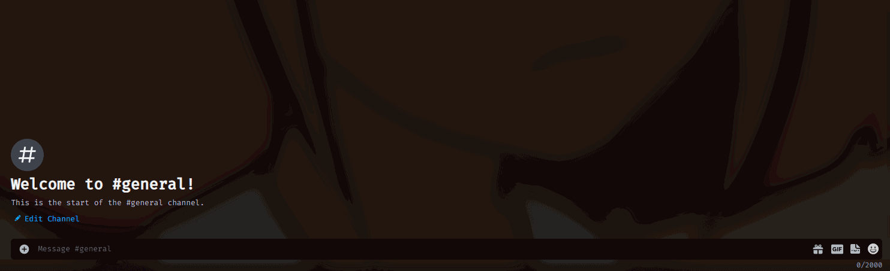

# KirkBot

## To do list
- [ ] Make it work
    - [ ] See above
    - [ ] See above
    - [ ] See above
    - [ ] See above
    - [ ] See above
    - [ ] Make tag game ~~ broken
    - [x] GCP dot status update in bot
    - [ ] ~~get tweets / search tweets~~ Elon killed Twitter API
    - [ ] Image manipulation
        - [x] React to a message with a command to make an image of that message
        - [ ] React to a message with a command to make an image of that user with added own message
        - [ ] Use image command with own message instead of reacting to a message
        - [ ] Reacting to an image puts the image in the react image
        - [ ] Idk where its at right now lol, lmao even
    - [ ] Economy
        - [x] Underlying economy system
        - [ ] Needs more games
    - [ ] Admin
        - Nothing yet
    - [ ] Music
        - Nothing yet

## Features

- [x] AI
    - [x] `@bot`: The bot replies with a message through markovian text generation.
    - [x] `ai`: The bot replies with a message through a large language model.
    - [x] If you reply to the bot with a message, it will reply back using the large language model.
- [x] Archive
    - [x] `on_message`: Archive all messages going through the bot.
    - [x] `archive`: Archive a channel into multiple zip files.
    - [x] `count`: Count the number of messages in a channel.
- [x] Autodelete
    - [x] `on_message`: Add a message to the autodelete queue of enabled channels.
    - [x] `autodelete start`: Start the autodelete queue for a channel.
    - [x] `autodelete list`: List all channels with autodelete enabled.
    - [x] `autodelete stop`: Stop the autodelete queue for a channel.
- [x] Autorole
    - [x] `on_member_join`: Assign a preset list of roles to a member when they join the server.
    - [x] `joinrole`: list all roles that are assigned to a member when they join the server.
    - [x] `joinrole add`: Add a role to the list of roles that are assigned to a member when they join the server.
    - [x] `joinrole remove`: Remove a role from the list of roles that are assigned to a member when they join the server.
- [x] Botmechanics
    - [x] `update`: Update the bot by pulling from the github repository.
    - [x] `load`: Load a cog.
    - [x] `un`: Unload a cog.
    - [x] `re`: Reload a cog.
    - [x] `reall`: Reload all cogs.
    - [x] `loadall`: Load all cogs.
    - [x] `stop`: Unload all cogs and stop the bot.
- [x] Botstatus
    - [x] `botstatus`: Get the current status of the bot.
    - [x] `botstatus set`: Set the status of the bot.
- [ ] Economy
    - [x] `balance`: Get the balance of a user.
    - [x] `leaderboard`: Get the leaderboard.
    - [x] `daily`: Get a daily reward.
    - [x] `undaily`: Reset the daily reward timer for a user. 
    - [x] `gamestats`: Get the statistics for a user.
    - [x] `tictactoe`: Play tictactoe with another user.
    - [x] `dicepoker`: Play dicepoker for a chance to win.
    - [x] `slots`: Play the slots for a chance to win.
    - [x] `coinflip`: Flip a coin for a chance to win.
    - [x] `blackjack`: Play blackjack for a chance to win.
- [x] Errorhandler
    - [x] `on_command_error`: Try to catch as many different errors as possible to provide detailed feedback.
- [x] Fun Commands
    - [x] `ping`: Get the bot's current response time.
    - [x] `8ball`: Ask the magic 8ball a question and get an answer back.
    - [x] `checkem`: Check for specific patterns in numbers.
    - [x] `bigletter`: Convert text to big letters.
    - [x] `braille`: Convert text to braille.
    - [x] `youtube`: Search for YouTube videos.
    - [x] `gcp dot minimal`: Get the base GCP dot status.
    - [x] `gcp dot full`: Get the full GCP dot status with explanations.
    - [x] `tag`: Tag a user and they become it.
    - [x] `who care`: Delete the message if no one cares.
    - [x] `flag`: Toggle if an emoji is reacted to a user by the bot.
    - [x] `wordcount user`: Get the word count for a specific member.
    - [x] `wordcount channel`: Get the word count for a specific word in a channel.
    - [x] `wordcount server`: Get the word count for a specific word in the server.
    - [ ] `connect 4`: Play connect 4 with another user.
- [ ] Images
    - [x] `react`: React to a message with a random react image with a speech bubble above and their message above that.
    - [x] `caption`: Caption the previous image or gif posted in the chat.
- [x] Invitelog
    - [x] `invite list`: List all invites for the server.
    - [x] `invite show`: Display the invite information for a specific invite.
    - [x] `invite kick`: Kick all users who joined through a specific invite.
- [ ] Moderator
    - [x] `commands`: List the modules that can be enabled or disabled.
    - [x] `commands show`: List all channels with modules enabled.
    - [x] `commands chatai`: Enable or disable the chatai module for a channel.
    - [x] `commands economy`: Enable or disable the economy module for a channel.
- [x] Helpcommand
    - [x] `help`: Get a list of all commands automatically generated from the commands in the cogs.
    - [x] `help cog`: Get a list of all commands in a specific cog.
    - [x] `help group`: Get a list of all commands in a specific group.
    - [x] `help command`: Get detailed information about a specific command.